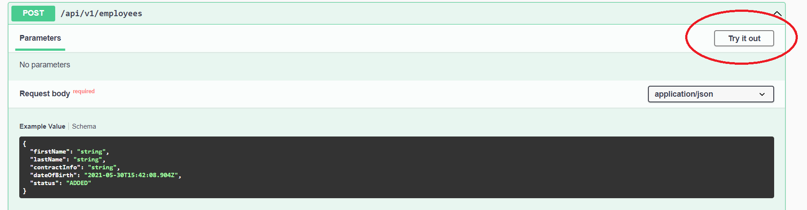

# Demo

This is a demo project.

Please keep in mind, that corresponding DB tables are created at the application start and dropped once it's turned off.

Container exposes port `8080` and matches it with `8080` by default.

Application use PostrgeSQl 13.1.

# Running
Use `docker-compose up` and `docker-compose down` to start and stop application.

# Documentation
Please refer to [spec](http://localhost:8080/swagger-ui/index.html?configUrl=/api-docs/swagger-config). There are brief auto-generated (Swagger) descriptions for existing endpoints. Also, you can try them out. Keep in mind, application must be up and running before you can access spec.

